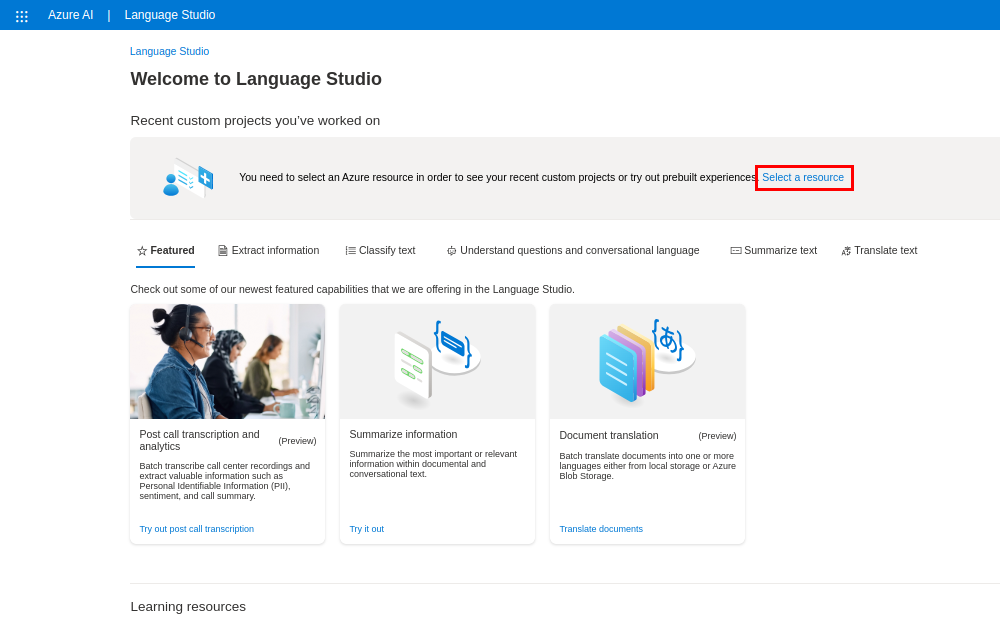
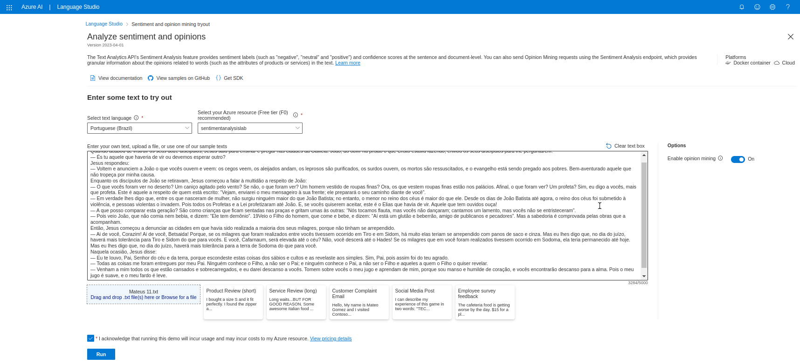
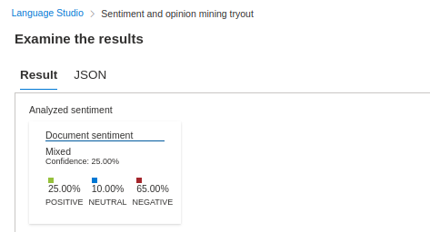
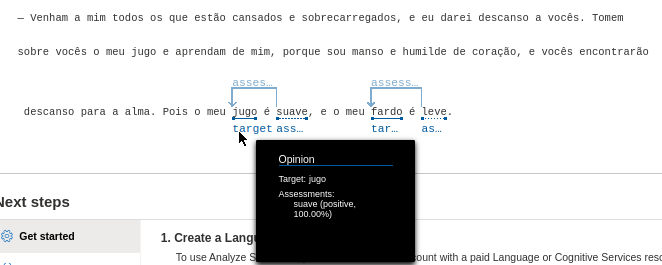

## 💬 Lab 03 – Análise de Sentimentos com Azure Language Studio
Este projeto faz parte do Bootcamp Microsoft Azure AI Fundamentals, promovido pela DIO. Aqui foram realizados testes com a ferramenta Language Studio do Microsoft Azure, focando no recurso de sentiment analysis e opinion mining — que identificam sentimentos (positivos, negativos, neutros) em textos fornecidos.

## 🧠 Tecnologias e Temas

## 📌 Índice
⚙️ Configuração do Ambiente

📊 Resultados e Observações

🧾 Conclusões e Insights

⚙️ Configuração do Ambiente
O processo seguiu os passos do guia oficial da Microsoft.

🔧 Criando o recurso no Azure
Acesse o Portal do Azure

Crie um recurso do tipo Language Service

Aguarde a finalização do deploy

    

    

## 🔗 Conectando ao Language Studio
Acesse o Azure Language Studio

Clique em "Select a resource"

Escolha o recurso criado anteriormente

    

    

## 🧪 Iniciando a análise
Após a conexão, usei o serviço “Analyze sentiment and mine opinions”, na seção Classify text.

    

## 📊 Resultados e Observações
Usei como base um trecho do livro de Mateus, da Bíblia Sagrada, para fins de teste.

▶️ Interface de análise

    

O sistema apontou que 65% do texto era negativo, mas a confiança geral era baixa (25%). Algumas frases mostraram confiança alta, enquanto outras tinham 0% de confiança, mesmo sendo classificadas como totalmente negativas.

Sentimento	      Porcentagem	    Confiança Média
 Negativo	          65%	               25%

    

 

    

 

    

## 💬 Opinion Mining
A funcionalidade de mineração de opinião também estava ativada e mostrou alguns relacionamentos entre palavras e opiniões extraídas.

    

## 🧾 Conclusões e Insights
A experiência foi positiva, especialmente por entender como ferramentas de IA podem ser aplicadas na análise de textos e sentimentos.

✅ Pontos fortes:
Fácil de usar via interface do Language Studio

Processamento automático e rápido

Útil para feedbacks e avaliações

⚠️ Limitações percebidas:
Baixa confiança em textos com linguagem bíblica/formal

A análise é feita frase por frase, ignorando o contexto geral

Resultados podem parecer inconsistentes quando o texto não é claramente opinativo

Uma análise baseada em contexto e correlação entre frases poderia melhorar bastante os resultados.
